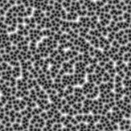
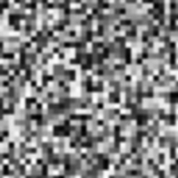
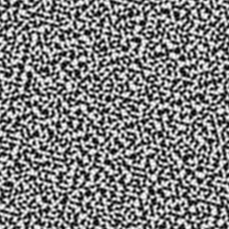
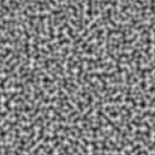
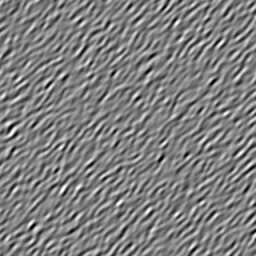
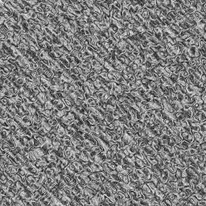
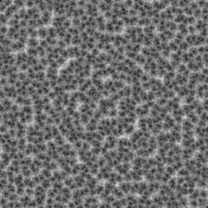

# Lattice
simple java noise

See the [demo](demo/src/main/java/net/flamgop/lattice/demo/Demo.java) for example usage.

## Samples

Images contain high contrast patterns (photosensitivity warning)

## License
TODO figure out licensing (probably going to be MIT)